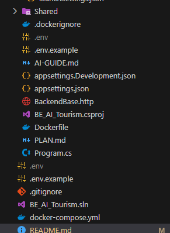
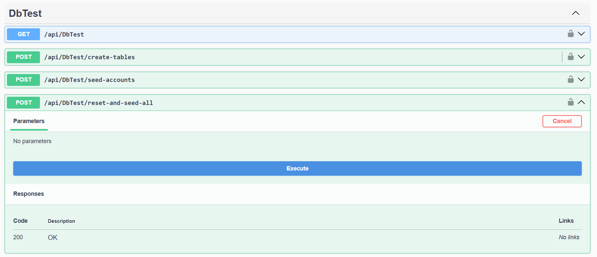

1. Yêu cầu hệ thống
Tải docker về máy: https://www.docker.com/products/docker-desktop/
Clone dự án BE về máy: git clone https://github.com/kimle6924-ops/ai-tourism-backend.git
2. Thêm file môi trường
Thêm 2 file .env đã gửi vào dự án: file 1.env để ở ngoài cùng thư mục dự án, file 2.env để bên trong

3. Build và khởi chạy hệ thống
Chạy lệnh này lần đầu tiên hoặc có sửa phía BE thì chạy lại(Lưu ý mở docker desktop lên):  docker compose up --build
4. Khởi chạy data mẫu
Build data mẫu vào link BE: http://localhost:5000/swagger/index.html
với api: reset-and-seed-all ấn Execute

=> Chạy BE đã xong chuyển sang chạy FE